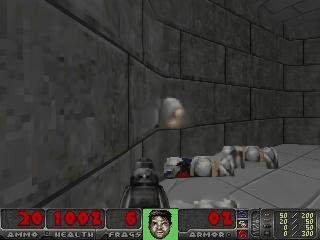
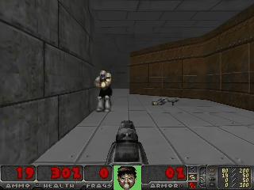

# gameNgen-repro

This repo contains the code to reproduce the results of the gameNgen paper. The model / inference has not been optimized enough to get to 20 FPS as reported in the paper.




## Artifacts

All artifacts are available on Hugging Face Hub:

Checkpoints:
- [gameNgen-baseline-20ksteps](https://huggingface.co/arnaudstiegler/gameNgen-baseline-20ksteps)
- [sd-model-gameNgen-60ksteps](https://huggingface.co/arnaudstiegler/sd-model-gameNgen-60ksteps)

Datasets:
- [vizdoom-5-episodes-skipframe-4-lvl5](https://huggingface.co/arnaudstiegler/vizdoom-5-episodes-skipframe-4-lvl5)
- [vizdoom-500-episodes-skipframe-4-lvl5](https://huggingface.co/arnaudstiegler/vizdoom-500-episodes-skipframe-4-lvl5)

Vizdoom Agent:
- `ViZDoomPPO/logs/models/deathmatch_simple/best_model.zip` (local)

## Scripts

### Generate the training data

First, cd into ViZDoomPPO/ and generate the venv from the `requirements.txt` file.

Then, run the following command to train an agent on vizdoom:
```
python train_ppo_parallel.py
```

Once the agent is trained, generate episodes and upload them as a HF dataset using:
```
python load_model_generate_dataset.py --episodes {number of episodes} --output parquet --upload --hf_repo {name of the repo}
```

Note: you can also generate a gif file to QA the behavior of the agent by running:
```
python load_model_generate_dataset.py --episodes 1 --output gif
```


### Train the diffusion model

Debug on a single sample:
```
python train_text_to_image.py  \
    --dataset_name arnaudstiegler/vizdoom-episode  \
    --gradient_checkpointing  \
    --train_batch_size 12  \
    --learning_rate 5e-5  \
    --num_train_epochs 1500  \
    --validation_steps 250  \
    --dataloader_num_workers 18 \
    --max_train_samples 2 \
    --use_cfg \
    --report_to wandb
```

Full training
```
python train_text_to_image.py \
    --dataset_name arnaudstiegler/vizdoom-500-episodes-skipframe-4-lvl5 \
    --gradient_checkpointing \
    --learning_rate 5e-5 \
    --train_batch_size 12 \
    --dataloader_num_workers 18 \
    --num_train_epochs 3 \
    --validation_steps 1000 \
    --use_cfg \
    --output_dir sd-model-finetuned \
    --push_to_hub \
    --lr_scheduler cosine \
    --report_to wandb
```

### Train the auto-encoder

```
python finetune_autoencoder.py --hf_model_folder {path to the model folder}
```

### Run inference (generating a single image)

```
python run_inference.py --model_folder arnaudstiegler/sd-model-gameNgen-60ksteps
```

### Run autoregressive inference

This will generate rollouts, where each new frame is generated by the model conditioned on the previous frames and actions.
We initially fill the buffer using the small dataset, and sample actions from the dataset (i.e it matches what the agent did in the episode)

```
python run_autoregressive.py --model_folder arnaudstiegler/sd-model-gameNgen-60ksteps
```
